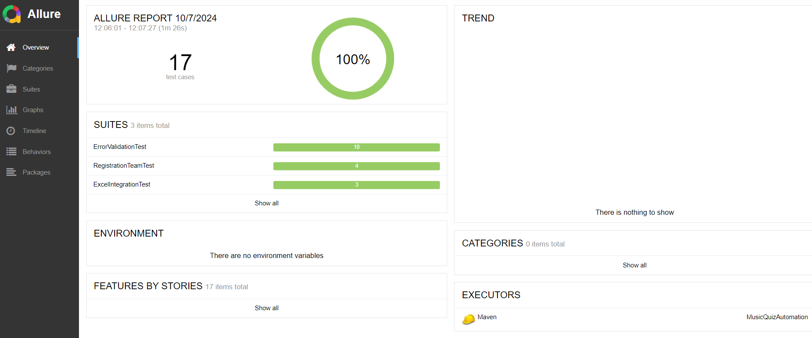
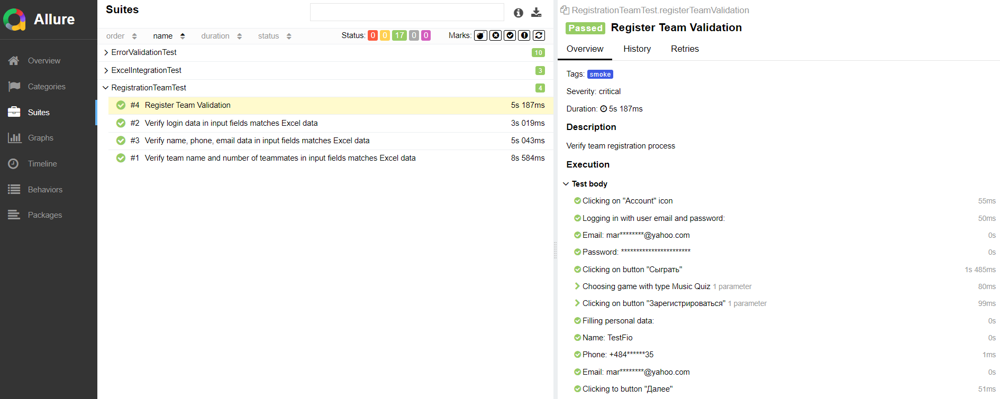

# Music Quiz UI Automation framework

## This is portfolio project on automation of test scripts using UI tests for  [wro.mzgb.net](https://wro.mzgb.net/)

## Contents:

- [Technology stack used](https://github.com/DaryaAndreyuk/music-quiz-automation/tree/fb_DaryaAndreyuk_18_AddReadMe?tab=readme-ov-file#technology-stack-used)
- [Instructions to Create a Valid `Sheet.xlsx` File](https://github.com/DaryaAndreyuk/music-quiz-automation/tree/fb_DaryaAndreyuk_18_AddReadMe?tab=readme-ov-file#instructions-to-create-a-valid-sheetxlsx-file)
- [Running the Tests from the terminal](https://github.com/DaryaAndreyuk/music-quiz-automation/tree/fb_DaryaAndreyuk_18_AddReadMe?tab=readme-ov-file#running-the-tests)
- [Viewing Allure Reports](https://github.com/DaryaAndreyuk/music-quiz-automation/tree/fb_DaryaAndreyuk_18_AddReadMe?tab=readme-ov-file#viewing-allure-reports)
- [Build with Github Actions](https://github.com/DaryaAndreyuk/music-quiz-automation/tree/fb_DaryaAndreyuk_18_AddReadMe?tab=readme-ov-file#build-with-github-actions)

## Technology stack used

In this project, automated tests are written in `Java 21` using the `Selenium` framework for UI testing.

- `Maven` is used as the build tool.
- `JUnit5` is the testing framework.
- `Allure` is integrated for generating test reports.
- The `Page Object Model` design pattern is implemented to separate the test logic from the UI structure, making the code more maintainable and reusable.
- For remote test execution, the project is set up with `Github Actions` which builds the tests, generates an `Allure` report, and publishes the results on `Github Pages`.
- Configured cloud-based testing with `Selenium Grid` for distributed and parallel test execution.
- Ensured security by masking sensitive data in the reports and automation processes.
- Implemented parameterized testing to optimize test case flexibility and scalability using `JUnit` annotations

## Instructions to Create a Valid `Sheet.xlsx` File

To create a valid `src/test/resources/data/Sheet.xlsx` file based on a template, follow these steps:

### Step 1: Locate the Template

A template file named `SheetTemplate.xlsx` is provided in the repository at `src/test/resources/data/SheetTemplate.xlsx`.

### Step 2: Copy the Template

Copy the `SheetTemplate.xlsx` file to create a new file named `Sheet.xlsx` in the same directory.

### Step 3: Open the Sheet.xlsx file in Excel or any other spreadsheet editor.
Make sure to fill in the required data fields as shown below:

### Example `Sheet.xlsx`

Here’s a detailed view of what the `SheetTemplate.xlsx` file should contain:

| Name                | John              |
| Phone               | 48152829319       |
| Email               | test@testmail.com |
| Team                | DreamTeam         |
| Number of teammates | 7                 |
| Password            | strongpass!@#$%57 |

Make sure each field corresponds to the expected format and content based on your application's requirements.

## Running the Tests

To execute all the tests, run the following command in the CLI: `mvn clean test -Pregression-tests`

To execute only smoke tests, run the following command in the CLI: `mvn clean test -Psmoke-tests`

To execute only positive tests, run the following command in the CLI: `mvn clean test -Ppositive-tests`

To execute only negative tests, run the following command in the CLI: `mvn clean test -Pnegative-tests`

## Viewing Allure Reports

After running the tests, you can view the Allure reports by executing:

`mvn allure:report`

## Example of Allure Report

## Report with test results

## Video how to build with Github Actions

## See Allure Report from Github Pages

If you have any comments or suggestions, please feel free to contact me
at: [dasha.andreyuk@gmail.com](dasha.andreyuk@gmail.com)

